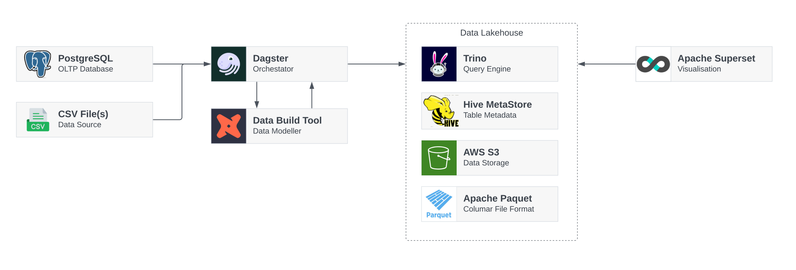

# Dagster Playground

**Table of Contents**

- [⚙ Setup](#setup)
- [Dagster Project](#dagster-project)
- [Docker Compose](#docker-compose)
  - [Trino](#trino)
  - [Hive MetaStore (TODO)](#hive-metastore)
  - [Metabase](#metabase)
  - [Apache SuperSet](#superset)
- [Python Practices](#python-practices)
  - [File & Module Composition](#file--module-composition)
- [References](#references)





## Setup

Assuming you have Python installed, run the following to install dependencies and start Dagster:

```bash
# Optional virtual environment setup
python3 -m venv .venv
source .venv/bin/activate

pip install -e ".[dev]"
dagster dev
```

## Dagster Project

Our Dagster project lives in [`quickstart_etl/`], which is read during `dagster dev`. The entry point is [`quickstart_etl/__init__.py`] which contains all high-level defintions.

Each file in here has comments intended to help understand the file and its contents purpose.

### Assets

> For more infomation see: [Software Defined Assets | GitHub]

In Dagster assets are descriptions of individual pieces of data, how to create/source them and any metadata (dependencies, refresh policies).

In [`quickstart_etl/assets/`] there are two different domains with differing load sources. `pagila` is fetched from our PostgreSQL database, and uses DBT to refine the models, while `iris` is a sourced from a Dagster example CSV dataset.

As you'll notice from these, assets can be a single file, or organised into their own module - See [Python Practices] for more info.

### Resources

This project primarily uses [DuckDB] and a Data Lakehouse (Trino, Parquet & Hive) to demonstrate the latest data storage options, and when to best use each.

DuckDB is fantastic for local development, simple to grasp and allows you to quickly move around a lightweight data store, however it doesn't scale particularly well.

A lakehouse trades the ease of use for an extremely high scaling potential, see [Trino](#trino) and [Hive Metastore](#hive-metastore) below, and [Why Lakehouse, Why Now? | Dremio] for more info.

In order to make use of a Lakehouse style architecture, this project contains a custom Trino IO Manager, see [`quickstart_etl/trino_io_manager/README.md`] for more info. 

The Parquet and Snowflake resources are cloned from the Dagster example project: [project_fully_featured | GitHub] as references of simple IO Managers.


## Docker Compose & Tech Stack

This project brings up various containers to form it's "data platform".

Should you need to interact with these containers individually you can run `docker compose <action> <service name>`, such as:
```
# Open Trino Shell
docker compose exec -it trino trino

# Tail Metabase logs
docker compose logs -f metabase
```

This can also be used to bring up individual containers. For example to just run Trino (and it's dependencies - like Minio) run the following: `docker compose up trino`. This can be useful when making configuration changes and wanting to see quick feedback.

Respective URLs for UIs:
- Minio - http://localhost:9001/browser
- Metabase - http://localhost:5000

### Trino

Trino is a distributed SQL query engine designed to efficiently query vast amounts of data, usually against flat files like parquet. It is also the query engine behind AWS Athena. 

With it being separate from the actual data storage, it can be scaled, deployed and managed independently for any storage or visualisation components. 

It's container is purely the querying aspect of our Lakehouse, while storage and table metadata is handled by Minio (Parquet) and Nessie (Iceberg). See [Iceberg Connector | Trino] for more information.

For clarity, querying does include CRUD operations and isn't limited to `SELECT`s.


### Hive Metastore

`TODO`

### Metabase

Metabase is a BI / Analytics platform for Data with a built-in query runner and various data visualisations.

We use a custom Dockerfile due to [Error loading shared library with DuckDB driver | GitHub], for more info see [`docker/metabase/Dockerfile`]: ./docker/metabase/Dockerfile.

On start-up the DuckDB file should be available under `/duckdb/database.duckdb`, which you can configure in Metabase's UI under [Add Database | localhost:5000].

NB: On first access, Metabase will prompt you for a user, which can be fake data. As the Metabase DB is in a volume, you won't be prompted again.

### Superset

The Superset setup here is simplied for local testing, for a more adequate and updated setup, check out [apache/superset | GitHub]


## Python Practices 

### File & Module Composition

Single files should be preferred to modules, like how [`quickstart_etl/assets/iris_csv.py`] is one file, in comparison to the Pagila Assets module: [`quickstart_etl/assets/pagila`].

When creating modules, `__init__.py` is normally a good starting point for containing everything. However, it can quickly grow, decreasing readability.

To remedy this, we can split `__init__.py` into multiple files, named after their purpose. For example, [`quickstart_etl/assets/pagila`] has a file solely for DBT assets, and one for fetching PostgreSQL data.

### Chunked Loading SQL Dataframe

When fetching large tables from a database, it's fairly easy to overload your RAM. To avoid this, we instruct Pandas to load in chunks:

```
def customer(psql: PagilaDatabase) -> pd.DataFrame:
    return pd.concat(
        pd.read_sql(
            "SELECT * FROM my_table", 
            psql.connection(), 
            chunksize=10000
        ), 
        ignore_index=True
    )
```


## References
- [Creating a new Dagster Project | Dagster]
- [The fancy data stack - batch version | Medium]
- [A portable data stack with Dagster, Docker, DuckDB, dbt and Superset | Medium]
- [dagster-project-example | GitHub]
- [practical-data-engineering | GitHub]
- [DuckDB, Trino and Spark comparison for DBT | Medium]
- [Why Lakehouse, Why Now? | Dremio]
- [Open Source and the Data Lakehouse | Dremio]

[`quickstart_etl/`]: ./quickstart_etl/
[`quickstart_etl/assets/`]: ./quickstart_etl/assets/
[`quickstart_etl/assets/pagila`]: ./quickstart_etl/assets/pagila
[`quickstart_etl/assets/iris_csv.py`]: ./quickstart_etl/assets/iris_csv.py
[`quickstart_etl/__init__.py`]: ./quickstart_etl/__init__.py
[`docker/metabase/Dockerfile`]: ./docker/metabase/Dockerfile
[`quickstart_etl/trino_io_manager/README.md`]: ./quickstart_etl/trino_io_manager/README.md

[project_fully_featured | GitHub]: https://github.com/dagster-io/dagster/tree/master/examples/project_fully_featured
[Software Defined Assets | Dagster]: https://docs.dagster.io/concepts/assets/software-defined-assets
[metabase-duckdb-driver | GitHub]: https://github.com//AlexR2D2/metabase_duckdb_driver
[Error loading shared library with DuckDB driver | GitHub]: https://github.com/AlexR2D2/metabase_duckdb_driver/issues/3
[Add Database | localhost:5000]: http://localhost:5000/admin/databases/create
[Creating a new Dagster Project | Dagster]: https://docs.dagster.io/getting-started/create-new-project
[The fancy data stack - batch version | Medium]: https://www.blef.fr/the-fancy-data-stack/
[A portable data stack with Dagster, Docker, DuckDB, dbt and Superset | Medium]: https://medium.com/data-engineers-notes/a-portable-data-stack-with-dagster-docker-duckdb-dbt-and-superset-f5ce42c1012
[dagster-project-example | GitHub]: https://github.com/AntonFriberg/dagster-project-example
[practical-data-engineering | GitHub]: https://github.com/sspaeti-com/practical-data-engineering
[DuckDB, Trino and Spark comparison for DBT | Medium]: https://medium.com/datamindedbe/head-to-head-comparison-of-dbt-sql-engines-497d71535881
[Why Lakehouse, Why Now? | Dremio]: https://www.dremio.com/blog/why-lakehouse-why-now-what-is-a-data-lakehouse-and-how-to-get-started/
[Open Source and the Data Lakehouse | Dremio]: https://www.dremio.com/blog/open-source-and-the-data-lakehouse-apache-arrow-apache-iceberg-nessie-and-dremio/
[Iceberg Connector | Trino]: https://trino.io/docs/current/connector/iceberg.html
[apache/superset | GitHub]: https://github.com/apache/superset
[Password file authentication | Trino]: https://trino.io/docs/current/security/password-file.html
[andreapiso/dagster-trino | GitHub]: https://github.com/andreapiso/dagster-trino
[DuckDB]: https://duckdb.org/